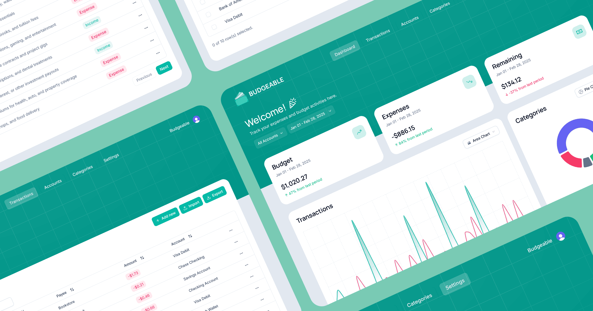

<div align="center">
  
  <h1 align="center">Budgeable</h1>
  <p align="center">Track expenses and budget activities</p>
</div>

<div align="center">
  <br />
  
  <br /><br />
  <div>
    
    
    
    
    
    
  </div>
</div>
<br />

Budgeable is a personal finance and budgeting web application designed to help users track their expenses, manage budgets, and gain insights into their spending habits. It has a simple, modern design with easy-to-understand data visualizations and integrates with Plaid for bank account synchronization, so that financial data is always up-to-date and easily accessible.

## 🗂️ Table of Contents

- [🗂️ Table of Contents](#️-table-of-contents)
- [✨ Features](#-features)
- [🚀 Getting Started](#-getting-started)
  - [📋 Prerequisites](#-prerequisites)
  - [⚙️ Installation Steps](#️-installation-steps)
  - [🛠️ Development](#️-development)
- [💻 Technology Stack](#-technology-stack)
- [📂 Project Structure](#-project-structure)
- [🤝 Contribution](#-contribution)
- [📄 License](#-license)

## ✨ Features

- **Dashboard Overview** - Offers a concise, at-a-glance overview of the user's financial situation through an intuitive dashboard. It displays key metrics such as total budget, expenses incurred, and remaining funds for user-defined periods. The dashboard features interactive charts, including quantitative charts (such as area chart, bar chart, and line chart) to visualize transaction trends over time and circular charts (such as pie chart, radar chart, and radial chart) that breaks down spending by various categories, enabling users to filter the data by specific accounts and custom date ranges for personalized financial analysis.

<details>
  <summary>See screenshot</summary><br>

</details>

- **Transaction Management** - Features a sortable and filterable table, allowing users to organize their financial activities and transactions by date, category, payee, amount, and account. It also supports manual transaction entry, bulk import capabilities, and allows users to select and delete multiple transactions efficiently, with pagination for easy navigation through extensive transaction lists.

<details>
  <summary>See screenshot</summary><br>

</details>

- **CSV Transaction Import** - Enables users to import transactions in CSV files. During the import process, users have the option to map columns in their CSV file (date, payee, amount, etc.) to respective fields in the application. This feature gives users flexibility to import data from different sources and prevents errors in data entry by giving them options to skip or properly map each column before confirming the import.

<details>
  <summary>See screenshot</summary><br>

</details>

- **Account Organization** - Users can define and manage various financial accounts, such as checking, savings, and credit cards. Users can easily add new accounts, filter through existing ones by name, and delete accounts as needed. This allows for clear segregation and tracking of funds across different financial instruments.

<details>
  <summary>See screenshot</summary><br>

</details>

- **Category Organization** - Users can define and manage custom spending categories (e.g., Groceries, Utilities, Entertainment). Similar to accounts, users can add new categories, filter them by name, and delete them. This structured categorization helps users understand their spending patterns and budget more effectively.

<details>
  <summary>See screenshot</summary><br>

</details>

- **Multi-Currency Support** - Lets users select their preferred display and storage currency from a comprehensive list of world currencies in the Settings page. When a new currency is chosen, all existing amounts are converted at the current exchange rate, and every figure across the dashboard, charts, tables, and forms is reformatted with the appropriate currency symbol and decimal precision for that currency.

<details>
  <summary>See screenshot</summary><br>

</details>

- **Bank Account Synchronization** - Allows users to securely connect their bank accounts via Plaid. This synchronization automatically fetches account transactions—including details like amount, date, type, and description—as well as account balances. This simplifies data entry, reduces manual effort, and ensures that the financial information within the web application is consistently up-to-date by syncing directly with the user's financial institutions.

<details>
  <summary>See screenshot</summary><br>

</details>

## 🚀 Getting Started

The following steps outline how to set up the project for local development and testing.

### 📋 Prerequisites

- **[Node.js](https://nodejs.org/)**: A JavaScript runtime environment that powers the backend of Budgeable and enables server-side JavaScript execution.
- **[Bun](https://bun.sh/docs/installation)**: An all-in-one JavaScript runtime, bundler, transpiler, and package manager.
- **[Git](https://git-scm.com/downloads)**: A distributed version control system needed to clone the repository and manage code changes.

> [!NOTE]
> Different package managers can be used (such as npm, pnpm, yarn), but the project was developed using Bun.

### ⚙️ Installation Steps

1. **Clone the repository**

   ```bash
   git clone https://github.com/neilivanorencia/budgeable.git
   ```

2. **Install dependencies**

   ```bash
   bun install
   ```

3. **Set up environment variables**

   Create a `.env` file in the root directory. Use the following template:

   ```plaintext
   # Clerk Authentication
   NEXT_PUBLIC_CLERK_PUBLISHABLE_KEY=
   CLERK_PUBLISHABLE_KEY=
   CLERK_SECRET_KEY=

   # Clerk Authentication URLs
   NEXT_PUBLIC_CLERK_SIGN_IN_URL=
   NEXT_PUBLIC_CLERK_SIGN_UP_URL=
   NEXT_PUBLIC_CLERK_SIGN_IN_FALLBACK_REDIRECT_URL=
   NEXT_PUBLIC_CLERK_SIGN_UP_FALLBACK_REDIRECT_URL=

   # Database
   DATABASE_URL=

   # Plaid Integration
   PLAID_CLIENT_ID=
   PLAID_SECRET_KEY=

   # Application URLs
   NEXT_PUBLIC_APP_URL=
   ```

   - Clerk keys are available in the Clerk dashboard after creating an application.
   - A PostgreSQL connection string is required for `DATABASE_URL` (services like Neon, Supabase, or a local instance are supported).
   - Plaid API keys and environment can be obtained from the Plaid dashboard.

4. **Run database migrations**

   ```bash
   bun run db:migrate
   ```

### 🛠️ Development

Start the development server by running:

```bash
npm run dev
# or
pnpm run dev
# or
yarn dev
# or
bun run dev
```

Open [http://localhost:3000](http://localhost:3000) with local browser to see the result.

## 💻 Technology Stack

- **Clerk** - An authentication platform offering social, passwordless, and multi-factor login options, basic user management and more.
- **Next.js** - A powerful React framework used for building fast and optimized web applications.
- **React** - A JavaScript library made by Facebook primarily used for building user interfaces for web applications.
- **shadcn/ui** - A UI component library specifically designed for building user interfaces in web applications using React.
- **Tailwind CSS** - A utility-first CSS framework that allows for quick and flexible styling using predefined classes.
- **Typescript** - A strongly typed programming language that builds on JavaScript by adding static types.

## 📂 Project Structure

<details>
  <summary>See project structure here</summary>

```plaintext
└── 📁.vscode
    ├── settings.json
└── 📁drizzle
    └── 📁meta
        ├── _journal.json
        ├── 0000_snapshot.json
        ├── 0001_snapshot.json
        ├── 0002_snapshot.json
    ├── 0000_budgeable.sql
    ├── 0001_additional_fields.sql
    ├── 0002_currency.sql
└── 📁public
    ├── auth-image.jpg
    ├── website-preview.png
└── 📁scripts
    ├── seed.ts
    ├── wipe.ts
└── 📁src
    └── 📁app
        └── 📁(auth)
            └── 📁signin
                └── 📁[[...signin]]
                    ├── page.tsx
            └── 📁signup
                └── 📁[[...signup]]
                    ├── page.tsx
        └── 📁(private)
            └── 📁accounts
                ├── actions.tsx
                ├── columns.tsx
                ├── layout.tsx
                ├── page.tsx
            └── 📁categories
                ├── actions.tsx
                ├── columns.tsx
                ├── layout.tsx
                ├── page.tsx
            └── 📁dashboard
                ├── layout.tsx
                ├── page.tsx
            └── 📁settings
                ├── layout.tsx
                ├── page.tsx
                ├── settings-card.tsx
            └── 📁transactions
                ├── account-column.tsx
                ├── actions.tsx
                ├── category-column.tsx
                ├── columns.tsx
                ├── import-card.tsx
                ├── import-table.tsx
                ├── layout.tsx
                ├── page.tsx
                ├── table-head-select.tsx
                ├── upload-button.tsx
            ├── layout.tsx
        └── 📁(public)
            ├── page.tsx
        └── 📁api
            └── 📁[[...route]]
                ├── accounts.ts
                ├── categories.ts
                ├── plaid.ts
                ├── route.ts
                ├── settings.ts
                ├── summary.ts
                ├── transactions.ts
        ├── globals.css
        ├── icon.svg
        ├── layout.tsx
    └── 📁components
        └── 📁skeletons
            ├── header-skeleton.tsx
            ├── page-skeleton.tsx
        └── 📁ui
            ├── background-ripple-effect.tsx
            ├── badge.tsx
            ├── button.tsx
            ├── calendar.tsx
            ├── card.tsx
            ├── checkbox.tsx
            ├── dialog.tsx
            ├── dropdown-menu.tsx
            ├── form.tsx
            ├── input.tsx
            ├── label.tsx
            ├── popover.tsx
            ├── select.tsx
            ├── separator.tsx
            ├── sheet.tsx
            ├── skeleton.tsx
            ├── sonner.tsx
            ├── table.tsx
            ├── textarea.tsx
            ├── tooltip.tsx
        ├── account-filter.tsx
        ├── amount-input.tsx
        ├── area-variant.tsx
        ├── bar-variant.tsx
        ├── chart.tsx
        ├── circular-chart.tsx
        ├── circular-tooltip.tsx
        ├── color-picker.tsx
        ├── count-up.tsx
        ├── custom-tooltip.tsx
        ├── data-card.tsx
        ├── data-chart.tsx
        ├── data-grid.tsx
        ├── data-table.tsx
        ├── date-filter.tsx
        ├── date-picker.tsx
        ├── filter.tsx
        ├── form-actions.tsx
        ├── header-logo.tsx
        ├── header.tsx
        ├── highlight-text.tsx
        ├── highlight.tsx
        ├── line-variant.tsx
        ├── motion-section.tsx
        ├── navigation-item.tsx
        ├── navigation.tsx
        ├── pie-variant.tsx
        ├── radar-variant.tsx
        ├── radial-variant.tsx
        ├── row-actions.tsx
        ├── select.tsx
        ├── table-columns.tsx
        ├── welcome-message.tsx
    └── 📁db
        ├── index.ts
        ├── schema.ts
    └── 📁features
        └── 📁accounts
            └── 📁api
                ├── use-bulk-delete-accounts.ts
                ├── use-create-account.ts
                ├── use-delete-account.ts
                ├── use-edit-account.ts
                ├── use-get-account.ts
                ├── use-get-accounts.ts
            └── 📁components
                ├── account-form.tsx
                ├── edit-account-sheet.tsx
                ├── new-account-sheet.tsx
            └── 📁hooks
                ├── use-new-account.ts
                ├── use-open-account.ts
                ├── use-select-account.tsx
        └── 📁categories
            └── 📁api
                ├── use-bulk-delete-categories.ts
                ├── use-create-category.ts
                ├── use-delete-category.ts
                ├── use-edit-category.ts
                ├── use-get-categories.ts
                ├── use-get-category.ts
            └── 📁components
                ├── category-form.tsx
                ├── edit-category-sheet.tsx
                ├── new-category-sheet.tsx
            └── 📁hooks
                ├── use-new-category.ts
                ├── use-open-category.ts
        └── 📁home
            └── 📁components
                ├── call-to-action.tsx
                ├── features.tsx
                ├── footer.tsx
                ├── hero.tsx
                ├── navigation-bar.tsx
                ├── preview.tsx
                ├── section-card.tsx
                ├── steps.tsx
            └── 📁hooks
                ├── use-active-section.ts
                ├── use-sticky-header.ts
        └── 📁plaid
            └── 📁api
                ├── use-create-link-token.ts
                ├── use-delete-connected-bank.ts
                ├── use-exchange-public-token.ts
                ├── use-get-connected-bank.ts
            └── 📁components
                ├── plaid-connect.tsx
                ├── plaid-disconnect.tsx
        └── 📁settings
            └── 📁api
                ├── use-get-currency.ts
                ├── use-update-currency.ts
            └── 📁hooks
                ├── use-currency.ts
        └── 📁summary
            └── 📁api
                ├── use-get-summary.ts
        └── 📁transactions
            └── 📁api
                ├── use-bulk-create-transactions.ts
                ├── use-bulk-delete-transactions.ts
                ├── use-create-transaction.ts
                ├── use-delete-transaction.ts
                ├── use-edit-transaction.ts
                ├── use-get-transaction.ts
                ├── use-get-transactions.ts
            └── 📁components
                ├── edit-transaction-sheet.tsx
                ├── new-transaction-sheet.tsx
                ├── transaction-form.tsx
            └── 📁hooks
                ├── use-new-transaction.ts
                ├── use-open-transaction.ts
    └── 📁hooks
        ├── use-confirm.tsx
    └── 📁lib
        ├── api-utils.ts
        ├── create-query-hooks.ts
        ├── create-store.ts
        ├── currencies.ts
        ├── hono.ts
        ├── plaid-sync.ts
        ├── seed.ts
        ├── table-meta.ts
        ├── utils.ts
    └── 📁providers
        ├── query-provider.tsx
        ├── sheet-provider.tsx
    ├── middleware.ts
    ├── migrate.ts
├── .env
├── .gitignore
├── .markdownlint.json
├── .prettierrc
├── bun.lock
├── components.json
├── drizzle.config.ts
├── eslint.config.mjs
├── LICENSE
├── next.config.ts
├── package.json
├── postcss.config.mjs
├── README.md
└── tsconfig.json
```

</details>

## 🤝 Contribution

This project is intended as a personal web project to learn and improve my personal skills when it comes to web development. But if you would like to suggest improvements or modifications, feel free to fork the repository and submit a pull request.

## 📄 License

Distributed under the [MIT License](https://opensource.org/license/mit). See `LICENSE` for more information.
